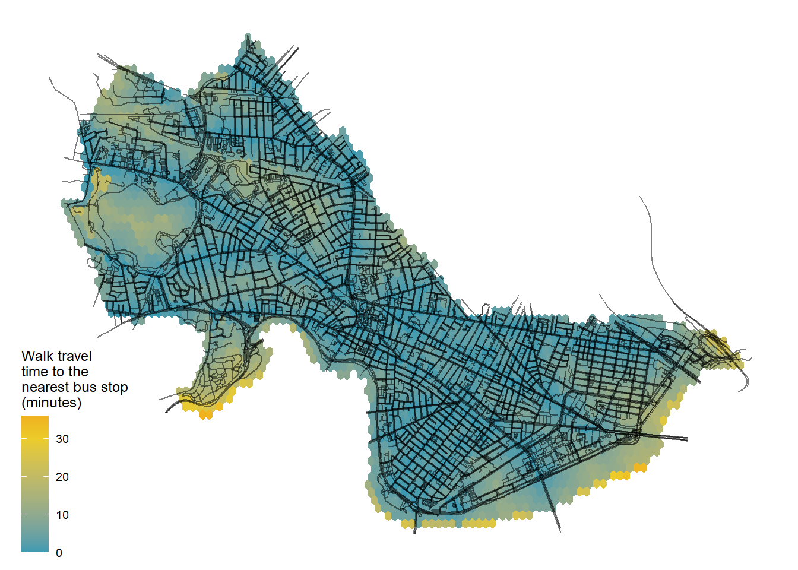

```{r setup, include=FALSE}
knitr::opts_chunk$set(echo = TRUE)
```

Below is my final portfolio for VIS 2128.

This example uses the `cerulean` theme, which is available by default.

There are 12 themes available by default: `cerulean`, `cosmo`, `flatly`, `journal`, `lumen`, `paper`, `readable`, `sandstone`, `simplex`, `spacelab`, `united`, and `yeti`.

This portfolio will demonstrate each of the following skills:

* Displaying multiple vector layers on the same map
* Calculating and displaying relationships among point and polygon layers based on distance
* Aggregating point data to a layer of polygons
* Calculating and displaying accessibility, based on travel time
* Converting between raster layers and vector layers
* Displaying raster data on a map
* Georeferencing a raster image
* Displaying data on an interactive map

# Static Maps
Here are two maps of Boston. I might include some text here about this set of maps.

##Private Owned Publics Spaces -  NYC
This  map demonstrates the following skills: 

* Displaying multiple vector layers on the same map

[](https://nrobalino.github.io/Robalino_Final/fullsize/A_POPS_in_NYC.png.pdf){target="_blank"}

## Bus Stops within Park Buffer Zone - Cape Town
This map demonstrates the following skills:

* Calculating and displaying relationships among point and polygon layers based on distance

[](https://nrobalino.github.io/Robalino_Final/fullsize/B_park_buffer.png.pdf){target="_blank"}

## Number of Housing Offices within a Township - Cape Town
This map demonstrates the following skills:

* Aggregating point data to a layer of polygons

[](https://nrobalino.github.io/Robalino_Final/fullsize/C_township_by_office.png.pdf){target="_blank"}

## Travel Time by Walking to Nearest Bus Stop - Cambridge
This map shows isochrones based on transit travel times to the nearest busstop. It demonstrates the following skills:

* Displaying multiple vector layers on the same map
* Calculating and displaying accessibility, based on travel time

[](https://nrobalino.github.io/Robalino_Final/fullsize/D2_access_busstop.png.pdf){target="_blank"}

## Accessbility by Walking to Publics Schools - Cambridge
This map shows accessibility based on a distance-decay function of the walking time to the nearest public school in Cambridge. It demonstrates the following skills:

* Displaying multiple vector layers on the same map
* Calculating and displaying accessibility, based on travel time

[](https://nrobalino.github.io/Robalino_Final/fullsize/D_access_travel_time.png.pdf){target="_blank"}

## Pedestrian Access to Schools - Cambridge
This map demonstrates the following skills:
* Converting between raster layers and vector layers

[](https://nrobalino.github.io/Robalino_Final/fullsize/E_raster_vector_convert.png.pdf){target="_blank"}


## Parks Data on a Historical Map - Washington DC
This map demonstrates the following skills:
* Displaying raster data on a map
* Georeferencing a raster image

[](https://nrobalino.github.io/Robalino_Final/fullsize/G_DC_parks.pdf){target="_blank"}

# Interactive Maps
## Latinx/Hispanic Population in North Carolina - Durham County
This map demonstrates the following skills:
* Displaying data on an interactive map


[](https://nrobalino.github.io/Robalino_Final/fullsize/H_Robalino_Assignment_6.hmtl){target="_blank"}


